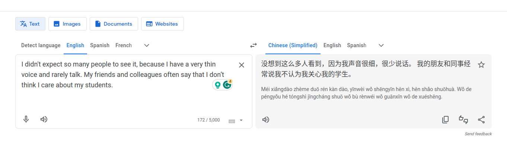
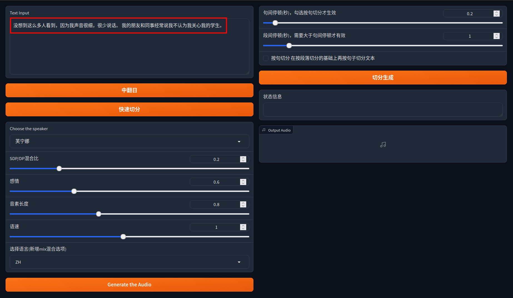
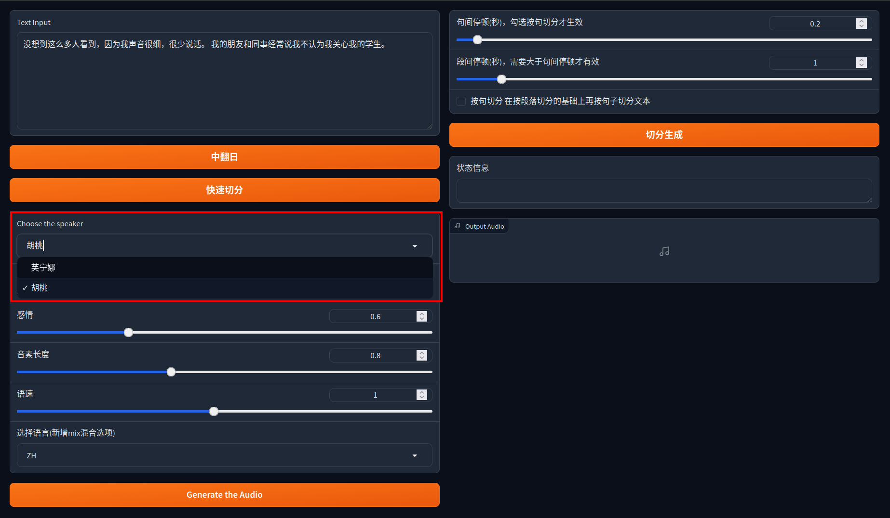
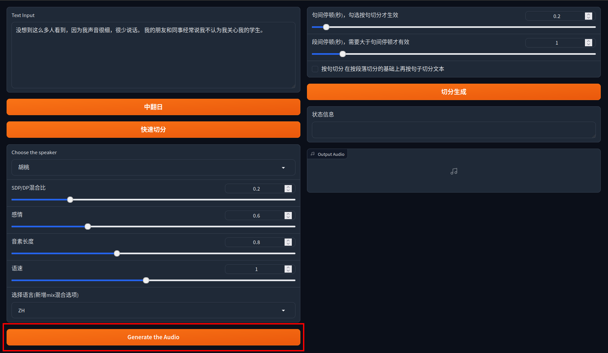
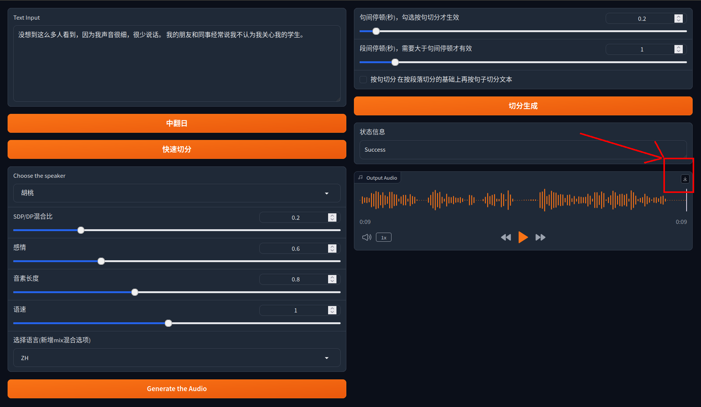
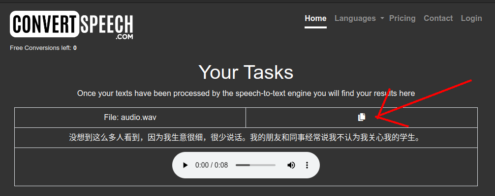
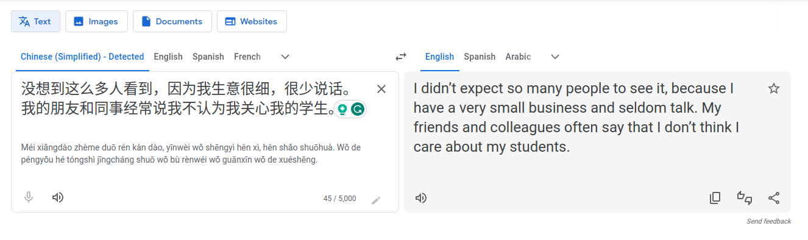

# Bert-VITS2-training

This repo is based on the excellent [Bert-VITS2](https://github.com/fishaudio/Bert-VITS2) and only for the purpose of my school project.


## Python environment
```bash
git clone https://github.com/sheyehs/Bert-VITS2-training.git
cd Bert-VITS2-training
conda create -n vits2 python=3.10.0
conda activate vits2
pip install -r requirements.txt
```
The cloning may take a few minutes because it needs to download model weights.
## Run the GUI
```bash
python webui.py
```
Refresh the webpage once if showing "Unable to connect".
## How to exam for English graders?
1. Open the Google Translation and translate your desired English sentences into Chinese(Simplified). For example this random sentence:

> I didn't expect so many people to see it, because I have a very thin voice and rarely talk. My friends and colleagues often say that I don’t think I care about my students.


2. Cpoy the Chinese sentences to the input area

3. Choose the second character because her sound is more moderate.

4. Click the generation button.

5. Download the audio file.

6. Open a tool that can convert Chinese speech to text, for example [this website](https://convertspeech.com/zh-CN/). Then copy the conversion result.

7. Open the Google Tranlation again and translate the result back to English and you can compare the difference.

Looks not bad! It only misunderstands `voice` and `business` because these two words sound similar in Chinese: `shengyin` and `shengyi` if represented by Pinyin.